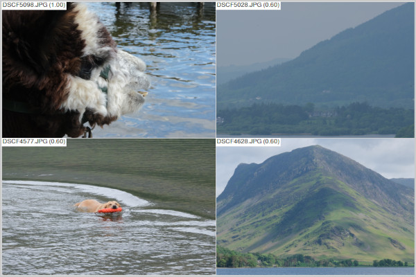
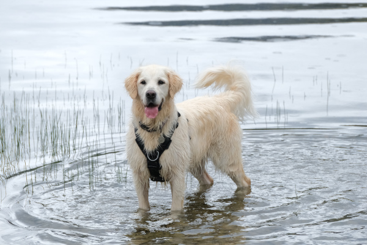
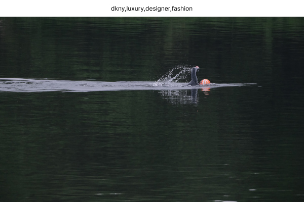
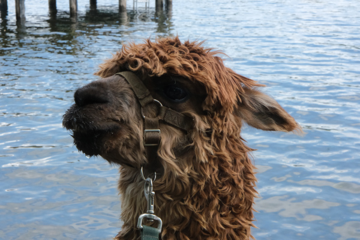

Keyword-tag images with a local LLM (default llava:7b) and use fuzzy match with a search query to find and display image matches.



### Example Use
Tag all photos in the specified directory.
```
python cli.py -t ~/Desktop/photos/
```
Query images for a keyword and return matches.
```
python cli.py -s mountains 
```

### Note
- Needs an ollama server running to tag images with keywords (but not to search stored keywords). Ensure ollama is installed and run `ollama serve`
- It doesn't work very well, though it used to (2 months ago) work better...


Donut,Mushroom,Pizza,Burger,Toast,Bread


dkny,luxury,designer,fashion


donut,crab cake,cake

- Perhaps it would work better with a different (larger) model, but I can't run >7B parameter models locally. Otherwise it's a simple change. 
